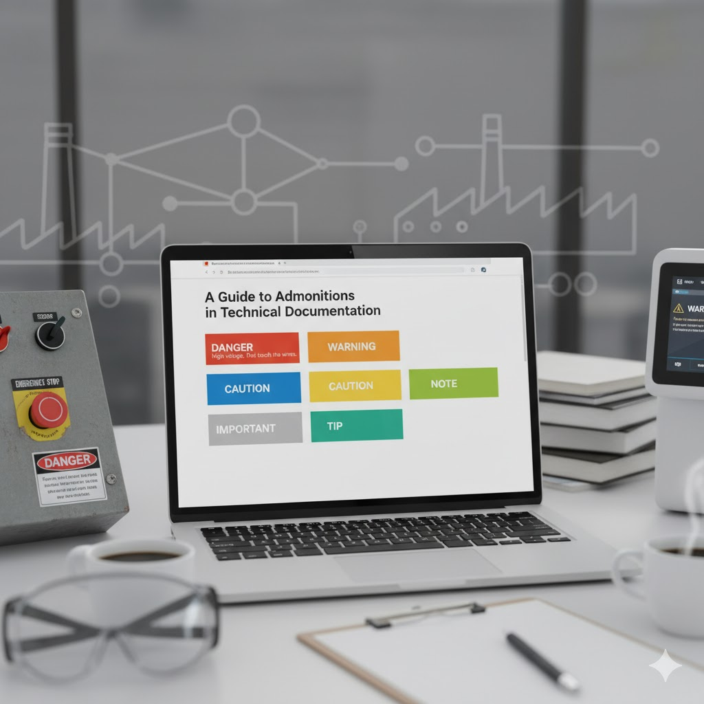

### A Hierarchy of Admonitions

Admonitions exist on a spectrum of severity. Using the correct type is critical. While most pure software documentation will only use `Warning` and below, it is essential to know the full, legally-defined hierarchy.

Here is the standard hierarchy, from most to least severe:

1.  **Danger:** Indicates an imminently hazardous situation that, if not avoided, *will* result in death or serious injury. This is the highest level of hazard and should be used extremely rarely, reserved almost exclusively for software that controls physical hardware (e.g., industrial machinery, medical devices).
2.  **Warning:** Indicates a potentially hazardous situation that, if not avoided, *could* result in death, serious injury, significant data loss, or a critical security vulnerability. This is the highest level for most software-only risks.
3.  **Caution:** Indicates a hazardous situation that, if not avoided, *may* result in minor or moderate injury, minor data loss, or unintended side effects (like a performance drop).
4.  **Important/Notice:** Highlights information that is *critical* for the user to succeed at a task. Ignoring it won't cause harm but may lead to failure, extra work, or the feature not working as expected.
5.  **Note/Info:** Provides supplemental information. This content is useful but *not critical*. The user can skip it and still complete the task successfully.
6.  **Tip/Hint:** Offers optional advice, shortcuts, or best practices that can make the user's task easier or more efficient.

### Use Cases and Examples

Here is when to use each admonition type, with examples for both software and hardware contexts.

| Type | When to Use It | Examples |
| :--- | :--- | :--- |
| **Danger** | **For life-threatening physical harm:** | "DANGER: High voltage. Do not touch the wires." "DANGER: This procedure will engage the robotic arm. Ensure all personnel are outside the safety cage." |
| **Warning** | **For serious, irreversible risk:** | **For data loss:** "WARNING: Running this command will permanently delete all user accounts." **For security:** "WARNING: Do not expose your private API key in client-side code." |
| **Caution** | **For potential problems or unintended side effects:** | **For performance:** "CAUTION: Enabling verbose logging may significantly increase server load." **For hardware:** "CAUTION: The processor is hot. Allow it to cool before handling." |
| **Important** | **For critical prerequisites or non-obvious consequences:** | **For prerequisites:** "IMPORTANT: You must update your database schema *before* deploying the new version." **For consequences:** "IMPORTANT: Changing this setting will log out all other users." |
| **Note** | **For clarification or extra context:** | **For scope:** "NOTE: This feature is only available on Enterprise plans." **For context:** "NOTE: The system automatically re-indexes every 15 minutes." |
| **Tip** | **For optional shortcuts and best practices:** | **For shortcuts:** "TIP: You can use the keyboard shortcut `Ctrl+G` to jump to any function." **For best practices:** "TIP: For better performance, we recommend running this bulk import during off-peak hours." |

### Best Practices for Admonitions

Using admonitions correctly is just as important as what you put in them. Overusing them will cause alert fatigue. Users will start to ignore admonitions, including the critical warnings.

#### Do:

  * **Use them sparingly.** If every other paragraph is an admonition, nothing stands out.
  * **Be precise.** Use the *correct* type for the situation. Don't use `WARNING` for something that is just a `NOTE`.
  * **Keep them short.** An admonition should be one or two clear sentences. If you need more text, it probably belongs in the main body.
  * **Place them correctly.** An admonition should be placed just *before* the step or concept it relates to.
  * **Be consistent.** Use the same style (icon, color, title) for the same admonition type across all your documentation.

#### Don't:

  * **Never use admonitions for normal content.** If the information is part of the standard procedure, write it as a standard paragraph or step.
  * **Don't "stack" admonitions.** Never place two or more admonitions back-to-back. It's visually confusing and dilutes their impact.
  * **Don't overuse `WARNING` or `DANGER`.** You know the story about the boy crying "Wolf!" This trains your users to ignore real dangers. Reserve these for genuine risks.
  * **Don't put prerequisites in a `NOTE`.** If a user *must* do something before starting, use `IMPORTANT` or make it the first step.

### Legal Standards and Compliance

The hierarchy of `DANGER`, `WARNING`, and `CAUTION` is not arbitrary; it is based on precise legal and regulatory standards. In any context involving physical hardware, medical devices, or industrial control, these words have legal definitions. You must put your documentation through a review with your regulatory and legal groups. If you don't and you post an incorrect message -- or worse, no message -- there could be severe liability exposure. Ask for regulatory and legal help. It's their job!

#### ANSI Z535 (United States)

This is the most important standard in the U.S. for safety communication from the **<a href="https://www.ansi.org" target="_blank">American National Standards Institute (ANSI)</a>**.

**ANSI Z535.6** legally defines the signal words for safety messages in product manuals.
  * **DANGER:** Indicates a situation that, if not avoided, **will** result in death or serious injury.
  * **WARNING:** Indicates a situation that, if not avoided, **could** result in death or serious injury.
  * **CAUTION:** Indicates a situation that, if not avoided, **may** result in minor or moderate injury.
  * **NOTICE:** This is the preferred ANSI word for messages related to **property damage only**.

#### ISO 3864 (International)

This is the international equivalent from the **<a href="https://www.iso.org" target="_blank">International Organization for Standardization (ISO)</a>**. It defines the graphical symbols, safety colors, and design principles for safety signs used internationally.

#### Regulatory Bodies (The "Enforcers")

Various government agencies adopt or enforce these standards, giving them the force of law:

  * **<a href="https://www.osha.gov" target="_blank">OSHA (Occupational Safety and Health Administration)</a>:** Enforces these standards in the workplace to protect employees.
  * **<a href="https://www.fda.gov" target="_blank">FDA (Food and Drug Administration)</a>:** Has extremely strict labeling regulations for medical devices and pharmaceuticals.
  * **<a href="https://www.cpsc.gov" target="_blank">CPSC (Consumer Product Safety Commission)</a>:** Regulates the labeling of consumer products to warn users of potential hazards.

-----

### Summary

Your responsibility as a technical writer depends on what you are documenting:

  * **For software-only products:** You are generally safe following the `Warning > Caution > Important` hierarchy as a set of **best practices** to help your users.
  * **For physical hardware, industrial machinery, or medical devices:** You are in the realm of **legal compliance and liability**. You *must* work with regulatory, legal and engineering experts to ensure every `DANGER` or `WARNING` label precisely matches the risk level defined by standards like ANSI Z535.

