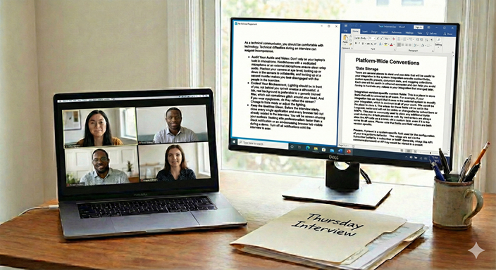

# A Technical Writer's Guide to Virtual Interviews
## A practical guide to virtual interviews for technical writers

My friend Aiofe was laid off in November due to downsizing. She's been looking for a new technical writing and editing job since. She's smart and capable, but has been having trouble with virtual interviews. I did a mock interview with her, and together, we came up with these recommendations. 

Virtual interviews can save time and sometimes get you immediate results. But virtual interviews have...issues. It can be hard to pick up on body language and nuance. And then there are technology problems that pop up. 

For a technical writer, the stakes in a video interview are higher. Hiring managers subconsciously judge your technical competence based on the technical setup.

So here is a guide to making sure the virtual interview goes well.

### The Digital Stage: Setup and Environment

As a technical communicator, you should be comfortable with technology. Technical difficulties during an interview can suggest incompetence.

* **Audit Your Audio and Video:** Don't rely on your laptop's built-in microphone. Headphones with a dedicated microphone or an external microphone ensure clear, crisp audio. Position your camera at eye level; looking up or down at the camera is unflattering, and looking up at a second monitor makes you look disengaged with the people in the interview.
* **Control Your Environment:** Lighting should be in front of you, not behind you (which creates a silhouette). A tidy, real background is preferable to a generic blurred filter, which can sometimes glitch around your head. And if you wear eyeglasses, do they reflect the screen? Change to Dark mode or adjust the lighting.
* **Keep the Desktop Clean:** Before the interview starts, close **every** single application and **every** browser tab not directly related to the interview. You will be screen-sharing your portfolio. Nothing kills professionalism faster than a Slack notification or an embarrassing browser tab visible during a demo. Turn off all notifications until the interview is over. 

### The "Me, Inc." Pitch Deck

The "Tell me about yourself" question is your first chance to stumble or to shine. Instead of wandering through your chronological work history, treat this question like a documentation project. Structure it.

Prepare a "pitch deck"—a simple, three-to-five-slide presentation you can screenshare. An example might be:

* **Slide 1: The Snapshot:** Your name, your core identity (e.g., "API Documentation Specialist" or "End-User Guide Expert"), and no more than three key skills that relate to the job posting.
* **Slide 2: The Philosophy:** A brief statement about how you approach technical writing (e.g., "I believe in docs-as-code and user-centric design") and why.
* **Slide 3: The Hook:** Why you are interested in *this specific* company and how your background solves their current problems. (You've done your research right? RIGHT??)

This tactic immediately demonstrates your ability to synthesize information, uses visuals to support a narrative, and shows you are proactive with technology.

### Walk Through Sample Documents: Show the *Process*, Not Just the Product

Your portfolio shows *what* you've done, but it needs to show *how.* You need to do more than open the PDF or Help site, scroll, and say, "Here is a sample user guide." The interviewers can read these later. As someone who hired writers throughout my career, I always looked at the documentation later, making notes if there was a follow-up interview. I wasn't looking so much at what you wrote, but *how* you wrote it. 

I suggest having 2–3 key portfolio pieces open in separate, clean browser tabs before the call begins. When asked to share, transition smoothly.

Use the STAR method (Situation, Task, Action, Result) adapted for portfolio reviews:

1. **The Context (Situation/Task):** Before showing the doc, set the stage. "At BlatherSoft, our developers were spending 40% of their time answering basic API integration questions because no documentation existed."
2. **The Walkthrough (Action):** Share your screen. Don't just read the text. Highlight design decisions. Point out how you structured the navigation for usability. Explain how you collaborated with difficult SMEs to extract this information. "You’ll notice I used a layout that includes the code sample right next to the parameter definitions." Talk about the tradeoffs you made and why. You might not think the document is "complete." Talk briefly about that and what changes you would make in revisions.
3. **The Outcome (Result):** Stop screen sharing to make eye contact. Deliver the metric. "After launching this portal, support tickets about integration dropped by 30% over six months."

### Handling the Curveballs

You will face tough questions. How you handle them matters more than knowing every answer instantly. They're looking for knowledge, but also probing for how you solve problems.

* **The Technical Stumper:** If they ask a highly technical question you don't know the answer to, do not bluff. A technical writer's job isn't to know everything; it's to know how to *find* out everything.
* **The Pivot:** "That’s a great question. I haven't worked with that specific framework in a while. In a real-world scenario, my first step would be to consult the engineering wiki, and then set up 15 minutes with the lead SME to verify my understanding before I document it."

> I was asked "How would you handle a situation where a chosen Hugo theme is no longer maintained, but it relies on an older version of Hugo or specific, non-standard layout structures that conflict with a newer, preferred theme?" I was gobsmacked. I felt everything around me crumbling. I managed to squeak out an answer that wasn't about what to do with Hugo, but how to attack the problem — how to qualify it, find resources, and come up with a plan. I didn't get the job, but the interviewers liked my answer.

* **The "Difficult SME" Question:** You will be asked about a time you dealt with a difficult stakeholder. Never blame the SME. Frame the challenge as a communication barrier that *you* took responsibility for solving through persistence, changing communication tactics, or building rapport.
 
> I think the "Difficult SME" is more a bogeyman than reality. In my experience, I've only had to deal with two difficult SMEs. Most co-workers give you too much information and are glad to have someone make what they do understandable.

### The "Never Dos" of Virtual Interviews

Avoid these instant red flags:

* **Never interrupt because of lag:** Video calls often have a slight audio delay. Leave an extra beat of silence after the interviewer finishes speaking before you begin. Talking over people is distracting and frustrating in a virtual setting.
* **Never use two screens poorly:** It’s obvious when you read notes off a second monitor; your eyes dart back and forth constantly. It’s okay to refer to notes occasionally, but keep your focus on the camera.
* **Never badmouth previous tools or teams:** Tech writers often inherit messy legacy documentation. Describe past messes neutrally as "challenges" or "opportunities for optimization," not as disasters created by incompetent predecessors. Your answer tells interviewers how you deal with challenges. Believe me, they know the issues and may be looking for you to help. Badmouthing people they've never met isn't going to score you a follow-up interview.

### The Wrap-Up and Follow-Through

When the interviewer asks, "Do you have any questions for us?" this is your final chance to make a good impression. Ask questions that show you understand the role of documentation in a business.

* *Good question:* "What is your current ratio of writers to developers?"
* *Better question:* "How does the documentation team currently measure success? Are you tracking deflection rates, time-to-onboard, or other metrics?"

Finish with enthusiasm. Reiterate your interest in the role and thank them for their time.

Once the camera is off, the interview isn't over. Send thank-you emails within 24 hours to everyone you spoke with. But don't send a generic, context-free email. Instead, reference a specific topic you discussed during the interview—perhaps an interesting challenge they mentioned or a joke you shared. This proves you were actively listening—the most crucial skill of any technical writer.