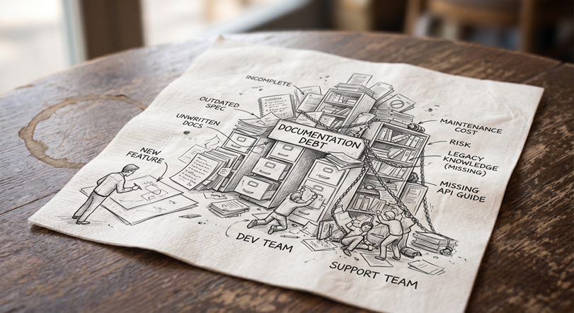

There's a conversation that happens in almost every software team, usually around the third sprint of a new project. Someone asks whether the new feature needs documentation. The answer — nearly universal — is some version of "we'll get to it."

They won't get to it.

Six months later, that same team is paying compound interest on a debt they never formally took out. Someone is reverse-engineering a deployment process from a Slack thread. Someone else is scheduled to extend a feature they don't understand. A new hire is asking questions that nobody can answer with confidence anymore, because the people who built the thing have moved on to something else. The contract technical writer you hired asks uncomfortable questions that take a lot of time to answer. And the answer is often composed of conflicting and out-of-date data.

This isn't a failure of discipline. It's a failure of framing — and it's a failure that technical writers are uniquely positioned to prevent, if organizations let them.

## Why "We'll Document Later" Always Loses

The problem isn't laziness. Most engineers and product teams genuinely intend to circle back. The problem is that documentation feels like overhead *in the moment of building* and becomes critical infrastructure *in the moment of maintaining*. Those two moments are separated by months, sometimes years — and the cost doesn't hit until it's too late to easily fix.

The math is lopsided in a way that's hard to argue with once you've lived it: adding documentation at release costs one to two days. Reconstructing it later — from memory, from code, from interviews with people who half-remember — costs one to two weeks, minimum. And that's before you count the bugs introduced by people guessing at intent.

## Writers Belong in the Room Where It Happens — From Day One

Here's something that gets treated as a staffing question but is really a process decision with measurable consequences: when does the technical writer join the project?

In too many organizations, writers hear about decisions second- or third-hand. Someone summarizes the standup. Someone forwards the design doc — but not the discussions around it. Someone eventually answers the writer's questions when they have a moment. By then, context has degraded, details have been smoothed over, and what gets documented is a reconstruction — not a record.

The cost of that gap is real. Technical writers embedded in development standups and design conversations do something engineers rarely have bandwidth to do: they ask the questions a user will eventually ask. "Why was this approach chosen over the alternative?" "What happens when this call fails?" "Who is the intended user of this feature, and what do they already know?" Before those questions are asked, they're invisible gaps. After they ship undocumented, they're support tickets, escalations, and onboarding delays.

Writers in the room catch assumptions before they become problems. Writers briefed after the fact document the assumptions without knowing they're there — and your users pay for that later.

Bringing writers in late compounds the problem. If development is well along before a writer gets involved, they're already behind. They'll spend their first weeks reconstructing decisions that were made without them, filling in context that was never written down. They never quite close the gap — and the documentation reflects it. You ship something technically accurate that users still can't follow, and your support queue tells you exactly what that costs.

The resource question is real: a writer in every standup is a commitment. So is a support team answering the same questions repeatedly because the documentation never explained the right things to the right people. One of those costs shows up in your planning. The other shows up in your metrics.

## What It Actually Costs

Managers budget for development. They rarely budget for the consequences of underdocumented development. Here's a rough comparison.

**The cost of doing it right:**

A staff technical writer runs $85,000–$130,000 annually fully loaded in the US. A contractor runs $75–$150 per hour. At ship time, documentation adds one to two days per project. A writer attending a daily standup costs roughly one to two hours per week of their time — time that pays for itself the first time it catches an assumption that would otherwise become a support escalation.

**The cost of not doing it:**

- **Support tickets.** Industry estimates put the fully-loaded cost of a single support ticket at $20–$50 for straightforward issues, and considerably more for technical escalations. Underdocumented software generates more of both. A team fielding 50 preventable tickets a month at $30 each is spending $18,000 a year answering questions that documentation should have already answered.
- **Onboarding.** A new engineer on an undocumented codebase takes weeks longer to reach productivity. At a fully-loaded engineering cost of $150,000–$200,000 annually, two extra weeks of reduced productivity costs $6,000–$8,000 per hire — before counting the senior engineer time spent answering their questions.
- **Incident response.** An undocumented deployment process means longer mean time to recovery when something goes wrong. At the cost of an engineering team on an incident bridge, hours matter.
- **Rework.** Features built on misunderstood architecture get rebuilt. Documentation written after the fact, without the original context, gets rewritten. Neither cost appears in the original estimate.

The one to two days spent documenting at ship time is not the expensive option. It's the only option with a predictable cost.

## The Biggest Mistake: Confusing Internal Docs With User Docs

Here's a pattern that plays out constantly, in organizations of every size: engineering produces a specification. Someone converts it into what they call user documentation. It is released.

It is **not** user documentation. It is an internal document with a new filename.

First drafts from engineering, whether specifications or docs created on the fly from specifications, are written by people who already understand the system deeply. They're full of internal jargon that means something precise to the team and nothing at all to a customer. They're built on assumed context: architecture decisions, integration constraints, organizational priorities that the end user has no access to and no reason to care about. They answer the questions engineers ask, not the questions users ask.

The user trying to install an integration doesn't need to know why a particular API design decision was made. They need to know what to click, what to enter, what success looks like, and what to do when it doesn't work. Those are completely different documents. Collapsing them into one produces something that serves neither audience well.

This is the core of what technical writers actually do, and why the work can't take shortcuts. Translating internal knowledge into user understanding requires knowing what the user **doesn't** know. That's not a writing skill, exactly. It's an empathy and analysis skill. It requires someone who can hold the engineering reality in one hand and the user's context in the other, and build a bridge between them. Engineers, by definition, can't fully occupy the position of a user who doesn't yet understand what they built. Closing that gap is what technical writers are trained to do — and it's work that doesn't happen by default.

## "We'll Just Use AI" Doesn't Fix This — It Amplifies It

Increasingly, the rationalization for skipping proper documentation sounds like this: "We'll feed the internal docs to an AI and let users query a chatbot."

This is the documentation problem in a more expensive costume.

The fundamental issue is simple: a large language model is only as good as what it's trained or prompted on. Feed it internal specifications, engineering decision logs, and first-draft content written for people who already understand the system, and you get a chatbot that confidently answers the questions engineers ask, using language engineers understand, for users who needed something else entirely.

Garbage in, garbage out has always been true. AI doesn't change that principle; it executes the failure faster and at greater scale, while adding a layer of confident fluency that makes wrong or incomplete answers harder to identify.

The category error runs deeper than just content quality. Feed an AI your architecture documentation and deployment runbooks — written for engineers, organized around how the system was built — and ask it to answer user questions about implementation and configuration. The AI will respond fluently, confidently, and from entirely the wrong frame of reference. It will answer as if the user needs to understand the system rather than use it. That's not an AI problem. That's a documentation problem that AI has been handed and told to solve. It can't, because the source material was never meant for that audience in the first place.

This is where the organizational risk becomes concrete. If no one owns the context an AI system reasons from — if that source material is whatever engineering happened to produce, unreviewed and unstructured for a user audience — then no one is accountable when the AI gives users confident, fluent, wrong answers. That's not a hypothetical. It's the predictable outcome of treating documentation as a byproduct and AI as a solution.

The emerging term for this responsibility is *context owner*: the person who governs what an AI system knows, how that knowledge is structured, and whether it accurately reflects what users need rather than what engineers built. AI doesn't curate its own source material. It compiles from what it's given. Someone has to decide what gets given, in what form, organized around whose needs — and that decision has direct consequences for every user interaction the AI handles.

That's the technical writer's job, evolved. Not writing instead of AI, and not being replaced by it, but owning the context that determines whether AI produces value or liability. Well-structured, user-centered documentation is *more* important in an AI-assisted environment, not less. The writer who understands both the engineering reality and the user's needs is the only person in the organization positioned to own that responsibility — and if that role doesn't exist, the risk doesn't disappear. It just goes unmanaged.

## What "Done" Actually Means

A project isn't done when the code ships. It's done when two separate groups — the team that will maintain it and the users who will depend on it — can each work with it confidently without having to ask anyone for help. Those are different audiences with different needs, and "done" means producing documentation for both.

**For internal teams**, every project should release with:

- **Architecture documentation.** A clear record of what was built, why key decisions were made, and what tradeoffs were accepted. It's written for future maintainers, not current ones.
- **A deployment runbook.** Step-by-step, environment-specific, and written for someone who wasn't in the room. The goal is that any qualified engineer can deploy or roll back without asking anyone anything.

**For end users**, every project should release with:

- **API documentation.** Every endpoint, every parameter, every expected response and error state. Undocumented APIs are black boxes, and black boxes fail in expensive ways, often at the user's expense.
- **Implementation documentation.** This is not how the system was built, but how to use it. What to configure, in what order, with what dependencies. Written for someone whose goal is a working integration, not an understanding of your architecture.
- **Interface documentation.** What the user sees, what it does, and why. Screen-level and workflow-level guidance that maps to the user's mental model, not the developer's.
- **Known issues and workarounds.** The most underrated item on either list. Documenting what *doesn't* work — and what to do about it — prevents the same problems from being rediscovered repeatedly and builds genuine trust with users who encounter the edges of your software.
- **Release notes.** Every change that affects the user's experience, stated plainly in terms of what changed, what it means, and what if anything they need to do. Not a commit log. Not a feature announcement. A clear, honest account of what's different and why it matters to them.

Notice what separates these two lists: internal documentation is written around how the system works; user documentation is written around what the user needs to accomplish. That distinction has to be deliberate and maintained. When it collapses — when the deployment runbook gets handed to a customer, or the implementation guide is written from the architecture document rather than from the user's workflow — both audiences end up underserved.

Maintaining that separation, and ensuring each document actually serves its intended reader, is itself a form of context ownership. It's the ongoing discipline of asking whose needs this document serves, and whether it honestly answers that question.

## The Framing Problem Is Yours to Fix

If your team consistently produces documentation that users can't follow, or skips it entirely at release time, the documentation process probably isn't the real problem. The real problem is that nobody has defined what documentation is actually for — or who owns it.

Documentation exists to transfer knowledge from the people who have it to the people who need it — efficiently, accurately, and without requiring a phone call. When it's treated as a byproduct of development rather than a deliverable in its own right, it ends up serving the people who already know the answer instead of the people who are asking the question.

Technical writers are the professionals whose entire job is to close that gap. But they can only do it if they're in the room when the knowledge is being created, and not summoned after the fact to document what's already been decided, built, and half-forgotten.

## Start Small, Start Now

If your team has documentation debt, the path out isn't a documentation sprint. It's changing the default going forward.

Pick your next project. Add the writer to the standups before the first line of code is written. Keep internal docs and user docs explicitly separate from the beginning — they have different audiences, different purposes, and different definitions of "complete." Before the project releases, produce the documents listed above, written for the people who will actually use them.

Then, six months from now, look at your support queue. Look at your onboarding time. Look at how long it takes a new engineer to get productive on that codebase.

Documentation isn't overhead. It's the part of the work that makes all the other work durable. And in a world where AI systems are increasingly part of how users interact with your product, the technical writer's role as context owner — the person who governs what those systems know and ensures it serves users rather than just reflecting internal assumptions — is more consequential than ever.

The best time to put a writer in the room was at the start of your last project. The second best time is now.
