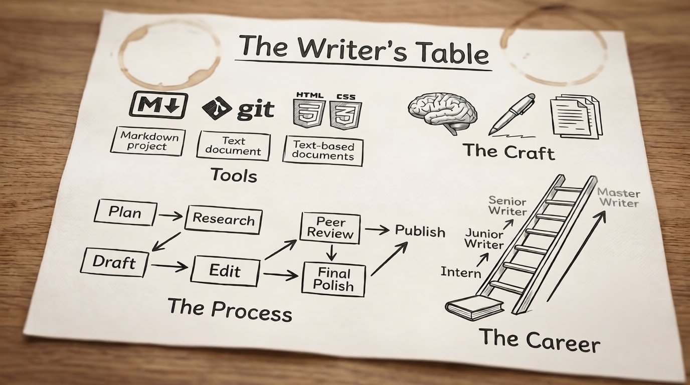

This is a reading and practice group, not a course. Each post covers one topic — craft, tools, process, career, etc. — and ends with an exercise you can work through. As articles are added, you can work through them in any order. 

The articles aren't exhaustive. They're designed and written to give you a starting point.

I'm also including references for further exploration with the articles. 

This started with twice a week posts; I've changed that cadence to three posts per week — Monday, Wednesday, and Friday — starting Monday, July 27. New and working writers both welcome.

I am posting the articles to my "The Way We Write Now" Substack. It's free; there is no subscription or pledge fee. 

  
Articles begin <strong>Monday, July 6</strong>. Follow along using the button here, and bookmark this page for the link to each article as they go live.

  <a href="/blog" class="cta-button">Follow Along &rarr;</a>

### NOTE! On the Subscription page, please click "No Pledge" if you see it! 

---

<h2 class="phase-heading">Phase 1: Foundation</h2>

### What the Job Is
- <a href="https://open.substack.com/pub/stevearrants/p/what-technical-writers-actually-do?r=5qqjk8&utm_campaign=post&utm_medium=web&showWelcomeOnShare=true" target="_blank">1A: What Technical Writers Actually Do</a>  **(July 6)**
- 1B: <a href="https://stevearrants.substack.com/p/mastering-audience-analysis?r=5qqjk8" target="_blank">Mastering Audience Analysis</a> **(July 9)**

### Writing Craft
- 2A: <a href="https://open.substack.com/pub/stevearrants/p/writing-for-the-f-pattern?r=5qqjk8&utm_campaign=post&utm_medium=web&showWelcomeOnShare=true" target="_blank">Writing for the F-Pattern</a> **(July 13)**
- 2B: <a href="https://stevearrants.substack.com/p/plain-language-is-not-dumbing-down" target="_blank">Plain Language Is Not Dumbing Down</a> **(July 16)**

### Editing
- 3A: <a href="https://stevearrants.substack.com/p/the-three-tiers-of-editing" target="_blank">The Three Tiers of Editing</a> **(July 20)**
- 3B: <a href="https://stevearrants.substack.com/p/the-passive-voice-myth" target="_blank">The Passive Voice Myth</a> **(July 23)**

<h2 class="phase-heading">Phase 2: Working with People &amp; Structure</h2>

### Working with People
- 4A: <a href="https://stevearrants.substack.com/p/working-with-smes" target="_blank">The Psychology of the SME</a> **July 27**
- 4B: Review and Approval Workflows *(coming July 29)*

### Content Structure
- 5A: Documentation Frameworks: A Field Guide *(coming July 31)*
- 5B: Stop the Sprawl: Information Architecture *(coming August 3)*
- 5C: Metadata and Taxonomy *(coming August 5)*

<h2 class="phase-heading">Phase 3: Content Types — What You Produce</h2>

### API Documentation
- 6A: API Docs 101: Demystifying REST *(coming August 7)*
- 6B: Beyond REST: OpenAPI and Swagger *(coming August 10)*

### Developer Documentation
- 7A: From Git Commits to Release Notes *(coming August 12)*
- 7B: Code Samples and Code Comments *(coming August 14)*

### UX Writing &amp; Accessibility
- 8A: Words in the Machine: Intro to UX Writing *(coming August 17)*
- 8B: Writing for Everyone: Accessibility *(coming August 19)*

### Visual Communication
- 9A: Visuals That Work (and Don't) *(coming August 21)*
- 9B: Diagrams as Code: Mermaid &amp; Draw.io *(coming August 24)*

<h2 class="phase-heading">Phase 4: The Modern Toolchain</h2>

### Authoring Environments
- 10A: The Shift to Docs-as-Code *(coming August 26)*
- 10B: Choosing Your Authoring Environment *(coming August 28)*

### Style &amp; Automation
- 11A: Enforcing Style Guides Without Being a Cop *(coming August 31)*
- 11B: Automated Linting and Consistency Checking *(coming September 2)*

<h2 class="phase-heading">Phase 5: Scale &amp; Strategy</h2>

### Scalable Documentation
- 12A: Write Once, Publish Everywhere *(coming September 4)*
- 12B: Modular Docs and the Philosophy of DITA *(coming September 7)*

### Global Strategy
- 13A: Writing for Translation and Localization *(coming September 9)*
- 13B: The Technical Writer as Strategist *(coming September 11)*

<h2 class="phase-heading">Phase 6: AI</h2>

### AI as Tool and Subject
- 14A: The Writer as Context Owner *(coming September 14)*
- 14B: Prompt Engineering for Tech Writers *(coming September 16)*
- 14C: Documenting AI and Non-Deterministic Software *(coming September 18)*

<h2 class="phase-heading">Phase 7: Process, Metrics &amp; Maintenance</h2>

### Agile &amp; Task Management
- 15A: Surviving the Two-Week Sprint *(coming September 21)*
- 15B: Task Management and Ticket Systems *(coming September 23)*

### Metrics &amp; Maintenance
- 16A: Proving Your Worth: Documentation Metrics *(coming September 25)*
- 16B: The Art of Deleting: Content Audits *(coming September 28)*

<h2 class="phase-heading">Phase 8: Career</h2>

### Career Development
- 17A: Building the NDA-Proof Portfolio *(coming September 30)*
- 17B: Contracting vs. Full-Time *(coming October 2)*

