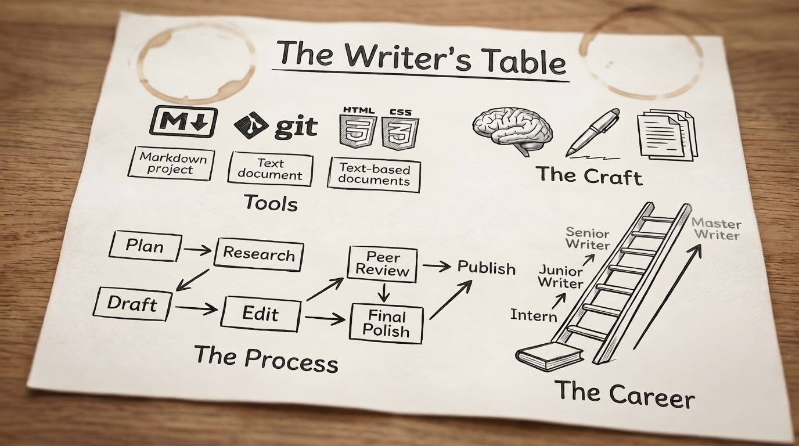

This is a reading and practice group, not a course. Each post covers one topic — craft, tools, process, career, etc. — and ends with an exercise you can work through. As articles are added, you can work through them in any order. 

I'm also including references for further exploration. 

Two posts per week, starting Monday, July 6. New and working writers both welcome.

I am posting the articles to my "The Way We Write Now" subtack. It's free; there is no subscription fee. 

  
Lessons begin <strong>Monday, July 6</strong>. Follow along to get each lesson as it publishes.

  <a href="/blog" class="cta-button">Follow Along &rarr;</a>

---

<h2 class="phase-heading">Phase 1: Foundation Weeks 1–3</h2>

### Week 1: What the Job Is
- 1A: What Technical Writers Actually Do *(coming July 6)*
- 1B: Mastering Audience Analysis *(coming July 9)*

### Week 2: Writing Craft
- 2A: Writing for the F-Pattern *(coming July 12)*
- 2B: Plain Language Is Not Dumbing Down *(coming July 16)*

### Week 3: Editing
- 3A: The Three Tiers of Editing *(coming July 20)*
- 3B: The Passive Voice Myth *(coming July 23)*

<h2 class="phase-heading">Phase 2: Working with People &amp; Structure Weeks 4–5</h2>

### Week 4: Working with People
- 4A: The Psychology of the SME *(coming July 27)*
- 4B: Review and Approval Workflows *(coming July 30)*

### Week 5: Content Structure
- 5A: Documentation Frameworks: A Field Guide *(coming August 3)*
- 5B: Stop the Sprawl: Information Architecture *(coming August 7)*

<h2 class="phase-heading">Phase 3: The Modern Toolchain Weeks 6–7</h2>

### Week 6: Authoring Environments
- 6A: The Shift to Docs-as-Code *(coming August 10)*
- 6B: Choosing Your Authoring Environment *(coming August 13)*

### Week 7: Style &amp; Automation
- 7A: Enforcing Style Guides Without Being a Cop *(coming August 17)*
- 7B: Automated Linting and Consistency Checking *(coming August 20)*

<h2 class="phase-heading">Phase 4: Process Weeks 8–9</h2>

### Week 8: Agile &amp; Task Management
- 8A: Surviving the Two-Week Sprint *(coming August 24)*
- 8B: Task Management and Ticket Systems *(coming August 27)*

### Week 9: Metrics &amp; Maintenance
- 9A: Proving Your Worth: Documentation Metrics *(coming August 31)*
- 9B: The Art of Deleting: Content Audits *(coming September 3)*

<h2 class="phase-heading">Phase 5: Specializations Weeks 10–13</h2>

### Week 10: API Documentation
- 10A: API Docs 101: Demystifying REST *(coming September 7)*
- 10B: Beyond REST: OpenAPI and Swagger *(coming September 10)*

### Week 11: Developer Documentation
- 11A: From Git Commits to Release Notes *(coming September 14)*
- 11B: Code Samples and Code Comments *(coming September 17)*

### Week 12: UX Writing &amp; Accessibility
- 12A: Words in the Machine: Intro to UX Writing *(coming September 21)*
- 12B: Writing for Everyone: Accessibility *(coming September 24)*

### Week 13: Visual Communication
- 13A: Visuals That Work (and Don't) *(coming September 28)*
- 13B: Diagrams as Code: Mermaid &amp; Draw.io *(coming October 1)*

<h2 class="phase-heading">Phase 6: AI Weeks 14–15</h2>

### Week 14: AI as a Tool
- 14A: The Writer as Context Owner *(coming October 5)*
- 14B: Prompt Engineering for Tech Writers *(coming October 8)*

### Week 15: AI as Subject Matter
- 15A: Documenting AI and Non-Deterministic Software *(coming October 12)*
- 15B: Metadata and Taxonomy *(coming October 15)*

<h2 class="phase-heading">Phase 7: Scale &amp; Strategy Weeks 16–17</h2>

### Week 16: Scalable Documentation
- 16A: Write Once, Publish Everywhere *(coming October 19)*
- 16B: Modular Docs and the Philosophy of DITA *(coming October 22)*

### Week 17: Global Strategy
- 17A: Writing for Translation and Localization *(coming October 26)*
- 17B: The Technical Writer as Strategist *(coming October 29)*

<h2 class="phase-heading">Phase 8: Career Week 18</h2>

### Week 18: Career Development
- 18A: Building the NDA-Proof Portfolio *(coming November 2)*
- 18B: Contracting vs. Full-Time *(coming November 5)*

